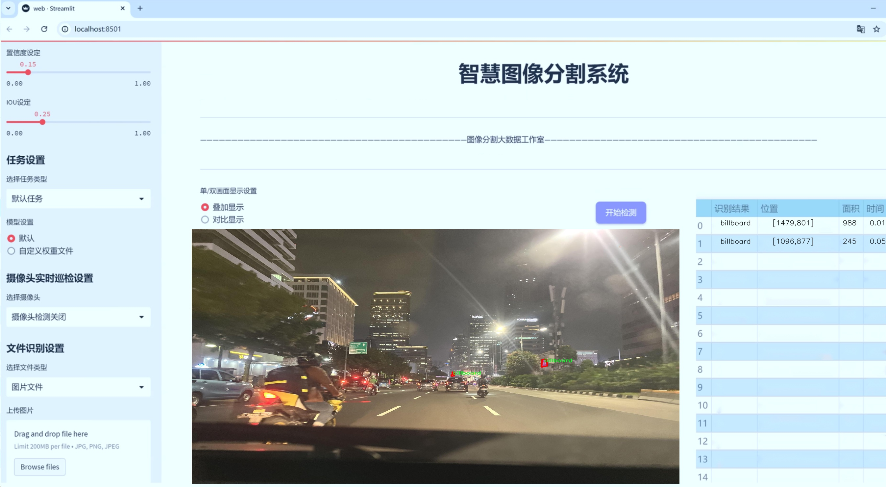
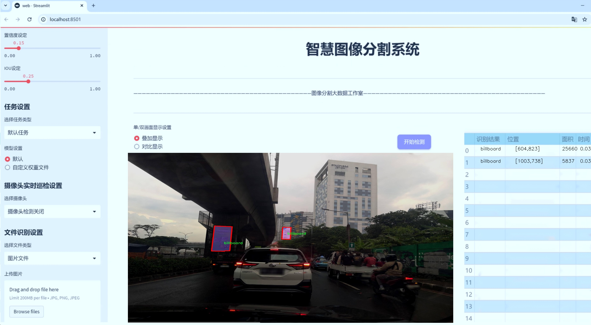
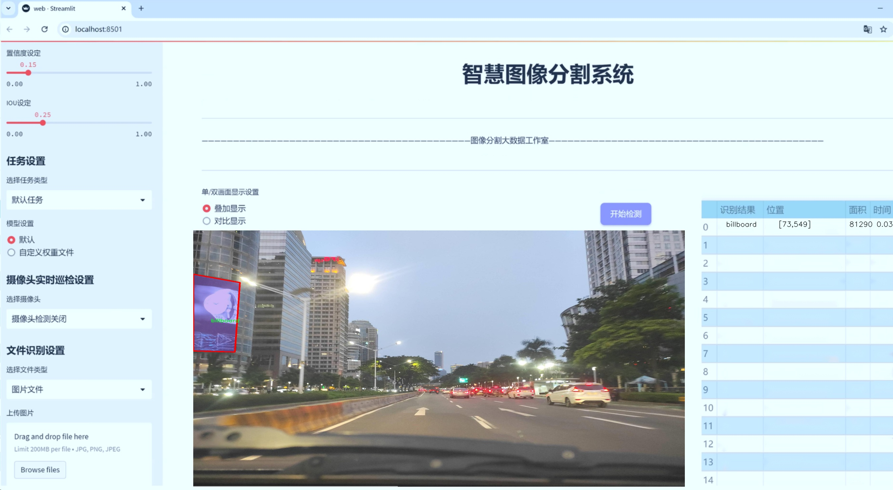
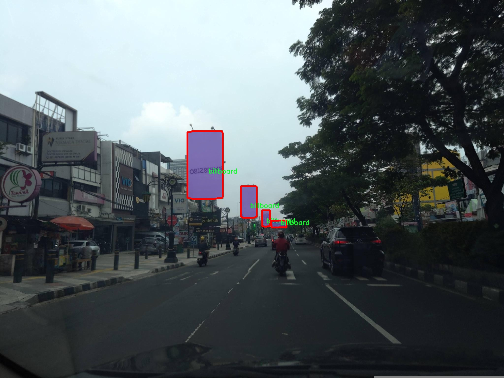
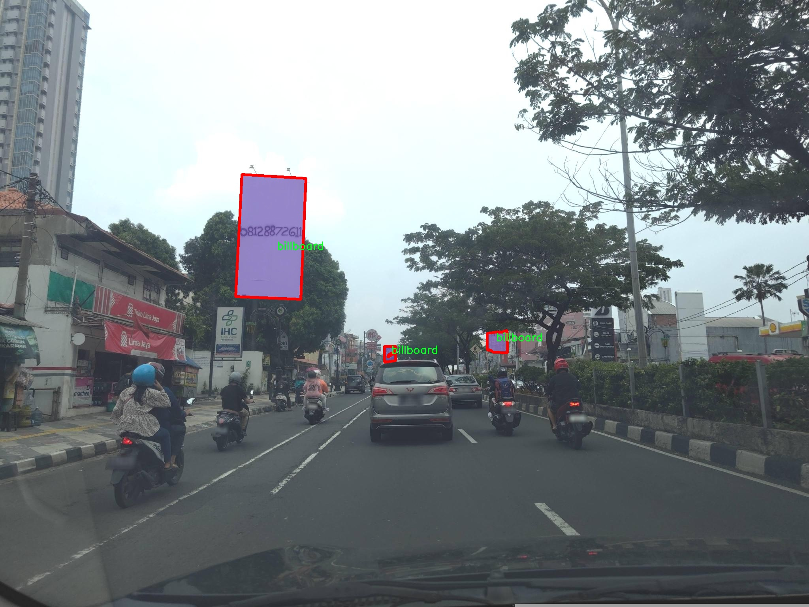
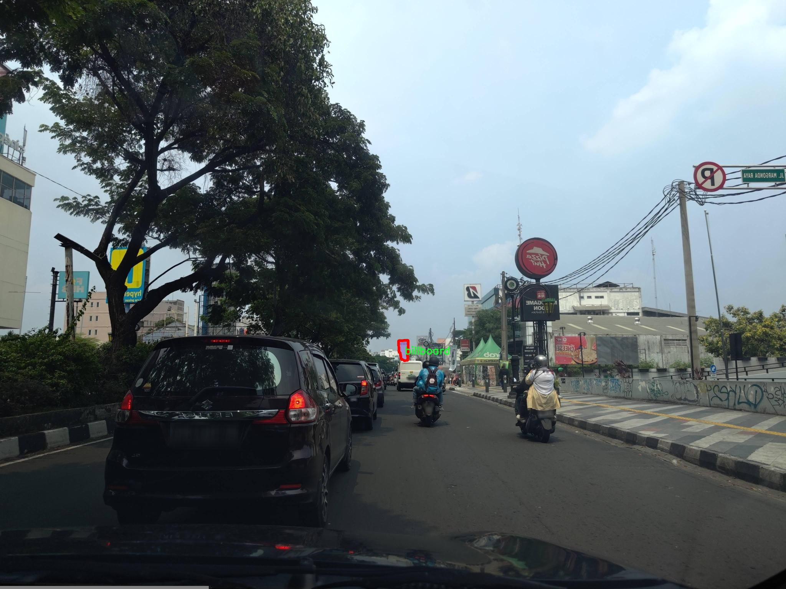
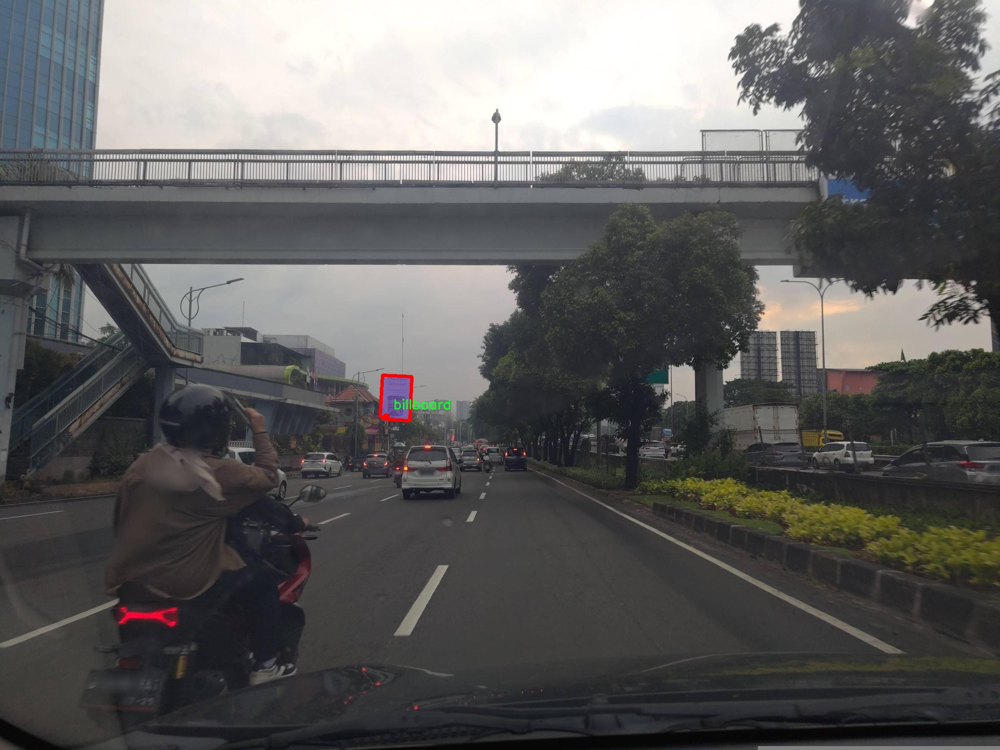
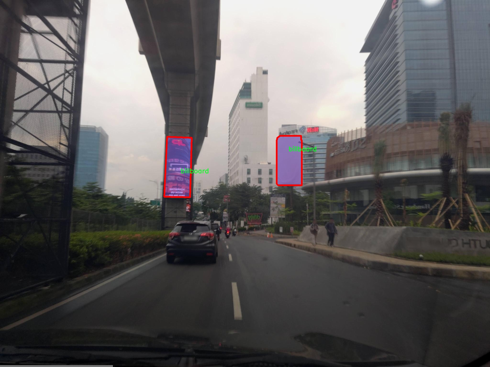

# 广告牌图像分割系统： yolov8-seg-EfficientRepBiPAN

### 1.研究背景与意义

[参考博客](https://gitee.com/YOLOv8_YOLOv11_Segmentation_Studio/projects)

[博客来源](https://kdocs.cn/l/cszuIiCKVNis)

研究背景与意义

随着数字化时代的到来，广告牌作为一种重要的户外广告形式，越来越多地出现在城市的各个角落。它们不仅是商业宣传的重要载体，也是城市文化和视觉艺术的重要组成部分。然而，传统的广告牌监测和管理方法往往依赖人工巡查，效率低下且容易出现遗漏。随着计算机视觉技术的快速发展，基于深度学习的图像分割技术逐渐成为广告牌自动识别与分析的重要工具。尤其是YOLO（You Only Look Once）系列模型，因其高效的实时检测能力而备受关注。YOLOv8作为该系列的最新版本，具有更强的特征提取能力和更快的推理速度，为广告牌图像分割提供了新的可能性。

本研究旨在基于改进的YOLOv8模型，构建一个高效的广告牌图像分割系统。该系统将利用一个包含2500张图像的广告牌数据集进行训练和验证。该数据集专注于广告牌这一单一类别，提供了丰富的样本，使得模型能够在不同的环境和光照条件下，准确识别和分割广告牌。这一研究不仅具有重要的理论意义，还有着广泛的实际应用价值。

首先，从理论层面来看，广告牌图像分割系统的构建为计算机视觉领域的实例分割技术提供了新的应用场景。通过对YOLOv8模型的改进，研究将探讨如何在保证实时性的前提下，提高分割精度。这将推动实例分割技术在特定领域的深入研究，丰富现有的计算机视觉理论体系。

其次，从实际应用的角度，广告牌图像分割系统的开发将极大提升广告监测的效率和准确性。该系统能够自动识别和分割广告牌，为广告投放效果评估、市场分析和城市管理提供数据支持。例如，城市管理部门可以利用该系统对广告牌的数量、位置和状态进行实时监控，及时发现违规广告，维护城市形象。同时，广告主也可以通过系统分析广告牌的曝光率和受众反馈，优化广告投放策略，提高广告效果。

此外，随着城市化进程的加快，广告牌的数量和种类日益增多，传统的人工管理方式已无法满足需求。基于改进YOLOv8的广告牌图像分割系统将为智能城市建设提供重要的技术支持，助力实现广告管理的智能化和自动化。这一研究不仅能够提升广告行业的运营效率，也为相关技术的推广和应用提供了有力的支撑。

综上所述，基于改进YOLOv8的广告牌图像分割系统的研究，既具有重要的理论价值，又能为实际应用提供切实可行的解决方案。通过这一研究，我们期望能够推动广告牌监测技术的发展，为城市管理和广告行业的智能化转型贡献力量。

### 2.图片演示







注意：本项目提供完整的训练源码数据集和训练教程,由于此博客编辑较早,暂不提供权重文件（best.pt）,需要按照6.训练教程进行训练后实现上图效果。

### 3.视频演示

[3.1 视频演示](https://www.bilibili.com/video/BV136UUYDEPr/)

### 4.数据集信息

##### 4.1 数据集类别数＆类别名

nc: 1
names: ['billboard']


##### 4.2 数据集信息简介

数据集信息展示

在本研究中，我们采用了名为“billboard-seg”的数据集，以训练和改进YOLOv8-seg广告牌图像分割系统。该数据集专注于广告牌的检测与分割，旨在提高计算机视觉领域中广告牌识别的准确性和效率。数据集的设计充分考虑了实际应用场景，确保其能够有效支持深度学习模型的训练与评估。

“billboard-seg”数据集包含一个类别，即“billboard”。这一类别的选择反映了我们研究的核心目标：在复杂的城市环境中，准确识别和分割广告牌。广告牌作为城市景观的重要组成部分，不仅承载着丰富的商业信息，还在视觉上影响着城市的美观与功能。因此，针对广告牌的图像分割技术的研究具有重要的实际意义。

在数据集的构建过程中，我们收集了大量高质量的广告牌图像，这些图像涵盖了不同的拍摄角度、光照条件和背景环境。这种多样性确保了模型在训练过程中能够学习到广告牌的多种特征，从而在实际应用中具备更强的鲁棒性和适应性。此外，数据集中每张图像都经过精细的标注，确保了广告牌的轮廓和位置信息的准确性。这种精确的标注为模型的训练提供了坚实的基础，使其能够在分割任务中实现更高的准确率。

在数据集的使用过程中，我们将采用数据增强技术，以进一步提高模型的泛化能力。通过对原始图像进行旋转、缩放、裁剪和颜色调整等操作，我们能够生成更多的训练样本。这种方法不仅丰富了训练数据的多样性，还有效防止了模型的过拟合现象，使其在面对未知数据时能够保持良好的性能。

为了评估模型的效果，我们将使用标准的性能指标，如交并比（IoU）、精确率和召回率等。这些指标将帮助我们量化模型在广告牌分割任务中的表现，从而为后续的改进提供数据支持。此外，我们还计划与现有的广告牌检测和分割方法进行对比，以验证我们提出的YOLOv8-seg系统在准确性和效率上的优势。

总之，“billboard-seg”数据集为我们研究广告牌图像分割系统提供了丰富的资源和良好的基础。通过对该数据集的深入分析和利用，我们期望能够推动广告牌识别技术的发展，为智能交通、城市管理和广告投放等领域提供更为高效的解决方案。随着技术的不断进步，我们相信这一领域将迎来更多的创新与突破。











### 5.项目依赖环境部署教程（零基础手把手教学）

[5.1 环境部署教程链接（零基础手把手教学）](https://www.bilibili.com/video/BV1jG4Ve4E9t/?vd_source=bc9aec86d164b67a7004b996143742dc)


[5.2 安装Python虚拟环境创建和依赖库安装视频教程链接（零基础手把手教学）](https://www.bilibili.com/video/BV1nA4VeYEze/?vd_source=bc9aec86d164b67a7004b996143742dc)

### 6.手把手YOLOV8-seg训练视频教程（零基础手把手教学）

[6.1 手把手YOLOV8-seg训练视频教程（零基础小白有手就能学会）](https://www.bilibili.com/video/BV1cA4VeYETe/?vd_source=bc9aec86d164b67a7004b996143742dc)


按照上面的训练视频教程链接加载项目提供的数据集，运行train.py即可开始训练



     Epoch   gpu_mem       box       obj       cls    labels  img_size
     1/200     0G   0.01576   0.01955  0.007536        22      1280: 100%|██████████| 849/849 [14:42<00:00,  1.04s/it]
               Class     Images     Labels          P          R     mAP@.5 mAP@.5:.95: 100%|██████████| 213/213 [01:14<00:00,  2.87it/s]
                 all       3395      17314      0.994      0.957      0.0957      0.0843

     Epoch   gpu_mem       box       obj       cls    labels  img_size
     2/200     0G   0.01578   0.01923  0.007006        22      1280: 100%|██████████| 849/849 [14:44<00:00,  1.04s/it]
               Class     Images     Labels          P          R     mAP@.5 mAP@.5:.95: 100%|██████████| 213/213 [01:12<00:00,  2.95it/s]
                 all       3395      17314      0.996      0.956      0.0957      0.0845

     Epoch   gpu_mem       box       obj       cls    labels  img_size
     3/200     0G   0.01561    0.0191  0.006895        27      1280: 100%|██████████| 849/849 [10:56<00:00,  1.29it/s]
               Class     Images     Labels          P          R     mAP@.5 mAP@.5:.95: 100%|███████   | 187/213 [00:52<00:00,  4.04it/s]
                 all       3395      17314      0.996      0.957      0.0957      0.0845


### 7.50+种全套YOLOV8-seg创新点加载调参实验视频教程（一键加载写好的改进模型的配置文件）

[7.1 50+种全套YOLOV8-seg创新点加载调参实验视频教程（一键加载写好的改进模型的配置文件）](https://www.bilibili.com/video/BV1Hw4VePEXv/?vd_source=bc9aec86d164b67a7004b996143742dc)

### YOLOV8-seg算法简介

原始YOLOv8-seg算法原理

YOLOv8-seg算法是由Ultralytics团队在YOLOv5的基础上发展而来的，旨在提升目标检测和分割任务的性能。该算法的提出，标志着YOLO系列模型在深度学习领域的又一次重要进步。YOLOv8-seg不仅继承了前几代YOLO模型的优点，还引入了一系列创新性的改进，特别是在网络结构、数据处理和任务对齐等方面。

首先，YOLOv8-seg在网络结构上进行了显著的优化。与YOLOv5相比，YOLOv8-seg的主干网络虽然变化不大，但在模块设计上进行了关键性的调整。C3模块被替换为C2f模块，这一改进的核心在于引入了更多的跳层连接，借鉴了YOLOv7中的ELAN（Efficient Layer Aggregation Network）思想。这种结构的变化不仅提升了梯度流的信息传递效率，还有效减轻了模型的计算负担，从而实现了轻量化设计。C2f模块通过更丰富的特征融合，使得模型在处理复杂场景时，能够更好地捕捉到目标的细节信息。

在颈部网络的设计上，YOLOv8-seg同样采用了C2f模块，且删除了上采样之前的卷积连接层。这一设计旨在简化网络结构，提高特征提取的效率。通过这种方式，YOLOv8-seg能够在保证检测精度的同时，减少计算资源的消耗，使得模型在实时应用中表现得更加出色。

头部网络的设计是YOLOv8-seg的另一大亮点。该算法采用了YOLOX中引入的解耦头结构，分别设立了两个并行的分支来提取类别和位置特征。这种分支设计的核心思想在于，分类任务与定位任务在特征提取上存在不同的侧重点。分类任务更关注特征图中各类特征的相似性，而定位任务则更关注边界框与真实框之间的空间关系。通过这种分离的方式，YOLOv8-seg能够更有效地进行特征学习，从而加快模型的收敛速度，提高预测精度。

在目标检测的过程中，YOLOv8-seg引入了无锚框结构，直接预测目标的中心位置。这一设计简化了传统目标检测模型中锚框的使用，使得模型在处理不同尺度和形状的目标时更加灵活。此外，YOLOv8-seg还引入了任务对齐学习（Task Alignment Learning，TAL），通过分类分数和IOU的高次幂乘积来衡量任务对齐的程度。这一创新使得模型在分类和定位任务的损失函数中都能够引入任务对齐的指标，从而实现更好的性能平衡。

数据预处理方面，YOLOv8-seg延续了YOLOv5的策略，但在具体实现上进行了调整。Mosaic数据增强技术虽然能够提升模型的鲁棒性和泛化能力，但在一定程度上可能会影响数据的真实分布。因此，YOLOv8-seg在训练的最后10个epoch中停止使用Mosaic增强，以确保模型学习到更真实的特征。这一策略的调整反映了YOLOv8-seg对数据质量的重视，旨在提升模型在实际应用中的表现。

在性能评估方面，YOLOv8-seg在COCO数据集上的表现相较于前几代YOLO模型有了显著提升。通过对比不同尺寸模型的mAP（mean Average Precision）值，YOLOv8-seg在参数量没有显著增加的情况下，取得了更高的精度和更快的推理速度。这一结果表明，YOLOv8-seg在设计上的优化有效提升了模型的综合性能，使其在目标检测和分割任务中具备了更强的竞争力。

总的来说，YOLOv8-seg算法通过对网络结构的优化、数据处理策略的调整以及任务对齐学习的引入，成功实现了目标检测和分割任务的性能提升。其轻量化设计和高效的特征提取能力，使得YOLOv8-seg在实时应用中表现出色，具有广泛的研究和应用价值。随着深度学习技术的不断发展，YOLOv8-seg无疑将在未来的目标检测领域中扮演重要角色，推动相关技术的进步与应用。


### 9.系统功能展示（检测对象为举例，实际内容以本项目数据集为准）

图9.1.系统支持检测结果表格显示

  图9.2.系统支持置信度和IOU阈值手动调节

  图9.3.系统支持自定义加载权重文件best.pt(需要你通过步骤5中训练获得)

  图9.4.系统支持摄像头实时识别

  图9.5.系统支持图片识别

  图9.6.系统支持视频识别

  图9.7.系统支持识别结果文件自动保存

  图9.8.系统支持Excel导出检测结果数据


### 10.50+种全套YOLOV8-seg创新点原理讲解（非科班也可以轻松写刊发刊，V11版本正在科研待更新）

#### 10.1 由于篇幅限制，每个创新点的具体原理讲解就不一一展开，具体见下列网址中的创新点对应子项目的技术原理博客网址【Blog】：


[10.1 50+种全套YOLOV8-seg创新点原理讲解链接](https://gitee.com/qunmasj/good)

#### 10.2 部分改进模块原理讲解(完整的改进原理见上图和技术博客链接)【如果此小节的图加载失败可以通过CSDN或者Github搜索该博客的标题访问原始博客，原始博客图片显示正常】

### YOLOv8简介
继YOLOv5之后,Ultralytics公司在2023年1月发布了YOLOv8,该版本可以用于执行目标检测、实例分割和图像分类任务。整个网络结构由4部分组成:输入图像, Backbone主干网络获得图像的特征图, Head检测头预测目标对象和位置, Neck融合不同层的特征并将图像特征传递到预测层。
1)相比于YOLOv5和 YOLOv7算法,YOLOv8在训练时间和检测精度上得到极大提升,而且模型的权重文件只有6 MB,可以部署到任一嵌入式设备中,它凭借自身快速、高效的性能可以很好地满足实时检测的需求。
2)由于YOLOv8算法是YOLOv5的继承版本，对应提供了N、S、 M、L、X 等不同尺度的模型,用于满足不同场景的需求,在精度得到大幅提升的同时,能流畅地训练,并且能安装在各种硬件平台上运行。
3)在输入端,YOLOv8算法使用了Mosaic数据增强[15]、自适应锚框计算[16]等方法。Mosaic数据增强是通过随机缩放、随机裁剪、随机排布的方式进行拼接,丰富检测数据集。自适应锚框计算是网络在初始锚框的基础上输出预测框,通过差值计算、反向更新等操作计算出最佳锚框值。
4)在输出端,YOLOv8算法使用解耦头替换了以往的耦合头,将分类和回归解耦为两个独立的分支,通过解耦使各个任务更加专注,从而解决复杂场景下定位不准及分类错误的问题。


### OREPA：在线卷积重参数化
卷积神经网络(CNNs)已经在许多计算机视觉任务的应用成功，包括图像分类、目标检测、语义分割等。精度和模型效率之间的权衡也已被广泛讨论。

一般来说，一个精度较高的模型通常需要一个更复杂的块，一个更宽或更深的结构。然而，这样的模型总是太重，无法部署，特别是在硬件性能有限、需要实时推理的场景下。考虑到效率，更小、更紧凑和更快的模型自然是首选。

为了获得一个部署友好且高精度的模型，有研究者提出了基于结构重参数化的方法来释放性能。在这些方法中，模型在训练阶段和推理阶段有不同的结构。具体来说，使用复杂的训练阶段拓扑，即重参数化的块，来提高性能。训练结束后，通过等效变换将一个复杂的块重参为成一个单一的线性层。重参后的模型通常具有一个整洁架构模型，例如，通常是一个类似VGG的或一个类似ResNet的结构。从这个角度来看，重参化策略可以在不引入额外的推理时间成本的情况下提高模型的性能。


BN层是重构模型的关键组成部分。在一个重新解析块(图1(b))中，在每个卷积层之后立即添加一个BN层。可以观察到，去除这些BN层会导致的性能退化。然而，当考虑到效率时，这种BN层的使用出乎意料地在训练阶段带来了巨大的计算开销。在推理阶段，复杂的块可以被压缩成一个卷积层。但是，在训练过程中，BN层是非线性的，也就是说，它们将特征映射除以它的标准差，这就阻止了合并整个块。因此，存在大量的中间计算操作(large FLOPS)和缓冲特征映射(high memory usage)。更糟糕的是，这么高的训练预算使得很难探索更复杂和可能更强的重参块。很自然地，下面的问题就出现了：

为什么标准化在重参中这么重要？

通过分析和实验，作者认为BN层中的尺度因子最重要，因为它们能够使不同分支的优化方向多样化。

基于观察结果，作者提出了在线重参化(OREPA)(图1(c))，这是一个两阶段的pipeline，使之能够简化复杂的training-time re-param block。

在第一阶段，block linearization，去除所有的非线性BN层，并引入线性缩放层。这些层与BN层具有相似的性质，因此它们使不同分支的优化多样化。此外，这些层都是线性的，可以在训练过程中合并成卷积层。

第二阶段，block squeezing，将复杂的线性块简化为单一的卷积层。OREPA通过减少由中间计算层引起的计算和存储开销，显著降低了训练成本，对性能只有非常小的影响。

此外，高效化使得探索更复杂的重参化拓扑成为可能。为了验证这一点，作者进一步提出了几个重参化的组件，以获得更好的性能。

在ImageNet分类任务上评估了所提出的OREPA。与最先进的修复模型相比，OREPA将额外的训练时间GPU内存成本降低了65%到75%，并将训练过程加快了1.5-2.3倍。同时，OREPA-ResNet和OREPA-VGG的性能始终优于+0.2%∼+0.6%之前的DBB和RepVGG方法。同时作者还评估了在下游任务上的OREPA，即目标检测和语义分割。作者发现OREPA可以在这些任务上也可以带来性能的提高。

提出了在线卷积重参化(OREPA)策略，这极大地提高了重参化模型的训练效率，并使探索更强的重参化块成为可能；

通过对重参化模型工作机制的分析，用引入的线性尺度层代替BN层，这仍然提供了不同的优化方向，并保持了表示能力;

在各种视觉任务上的实验表明，OREPA在准确性和训练效率方面都优于以前的重参化模型(DBB/RepVGG)。


#### 结构重参化
结构重参化最近被重视并应用于许多计算机视觉任务，如紧凑模型设计、架构搜索和剪枝。重参化意味着不同的架构可以通过参数的等价转换来相互转换。例如，1×1卷积的一个分支和3×3卷积的一个分支，可以转移到3×3卷积的单个分支中。在训练阶段，设计了多分支和多层拓扑来取代普通的线性层(如conv或全连接层)来增强模型。Cao等讨论了如何在训练过程中合并深度可分离卷积核。然后在推理过程中，将训练时间的复杂模型转移到简单模型中，以便于更快的推理。

在受益于复杂的training-time拓扑，同时，当前的重参化方法训练使用不可忽略的额外计算成本。当块变得更复杂以变得更强的表示时，GPU内存利用率和训练时间将会越来越长，最终走向不可接受。与以往的重参化方法不同，本文更多地关注训练成本。提出了一种通用的在线卷积重参化策略，使training-time的结构重参化成为可能。


#### Normalization
BN被提出来缓解训练非常深度神经网络时的梯度消失问题。人们认为BN层是非常重要的，因为它们平滑了损失。最近关于无BN神经网络的研究声称，BN层并不是不可或缺的。通过良好的初始化和适当的正则化，可以优雅地去除BN层。

对于重参化模型，作者认为重参化块中的BN层是关键的。无BN的变体将会出现性能下降。然而，BN层是非线性的，也就是说，它们将特征图除以它的标准差，这阻止了在线合并块。为了使在线重参化可行，作者去掉了重参块中的所有BN层，并引入了BN层的线性替代方法，即线性缩放层。

#### 卷积分解
标准卷积层计算比较密集，导致大的FLOPs和参数量。因此，卷积分解方法被提出，并广泛应用于移动设备的轻量化模型中。重参化方法也可以看作是卷积分解的某种形式，但它更倾向于更复杂的拓扑结构。本文的方法的不同之处在于，在kernel-level上分解卷积，而不是在structure level。

#### 在线重参化
在本节中，首先，分析了关键组件，即重参化模型中的BN层，在此基础上提出了在线重参化(OREPA)，旨在大大减少再参数化模型的训练时间预算。OREPA能够将复杂的训练时间块简化为一个卷积层，并保持了较高的精度。

OREPA的整体pipeline如图所示，它包括一个Block Linearization阶段和一个Block Squeezing阶段。


参考该博客通过分析多层和多分支结构的优化多样性，深入研究了重参化的有效性，并证明了所提出的线性缩放层和BN层具有相似的效果。

最后，随着训练预算的减少，进一步探索了更多的组件，以实现更强的重参化模型，成本略有增加。

#### 重参化中的Normalization
作者认为中间BN层是重参化过程中多层和多分支结构的关键组成部分。以SoTA模型DBB和RepVGG为例，去除这些层会导致严重的性能下降，如表1所示。


这种观察结果也得到了Ding等人的实验支持。因此，作者认为中间的BN层对于重参化模型的性能是必不可少的。

然而，中间BN层的使用带来了更高的训练预算。作者注意到，在推理阶段，重参化块中的所有中间操作都是线性的，因此可以合并成一个卷积层，从而形成一个简单的结构。

但在训练过程中，BN层是非线性的，即它们将特征映射除以其标准差。因此，中间操作应该单独计算，这将导致更高的计算和内存成本。更糟糕的是，如此高的成本将阻止探索更强大的训练模块。

#### Block Linearization
如3.1中所述，中间的BN层阻止了在训练过程中合并单独的层。然而，由于性能问题，直接删除它们并不简单。为了解决这一困境，作者引入了channel级线性尺度操作作为BN的线性替代方法。

缩放层包含一个可学习的向量，它在通道维度中缩放特征映射。线性缩放层具有与BN层相似的效果，它们都促进多分支向不同的方向进行优化，这是重参化时性能提高的关键。除了对性能的影响外，线性缩放层还可以在训练过程中进行合并，使在线重参化成为可能。


基于线性缩放层，作者修改了重参化块，如图所示。具体来说，块的线性化阶段由以下3个步骤组成：

首先，删除了所有的非线性层，即重参化块中的BN层

其次，为了保持优化的多样性，在每个分支的末尾添加了一个缩放层，这是BN的线性替代方法

最后，为了稳定训练过程，在所有分支的添加后添加一个BN层。

一旦完成线性化阶段，在重参化块中只存在线性层，这意味着可以在训练阶段合并块中的所有组件。

#### Block Squeezing
Block Squeezing步骤将计算和内存昂贵的中间特征映射上的操作转换为更经济的kernel上的操作。这意味着在计算和内存方面从减少到，其中、是特征图和卷积核的空间尺寸。

一般来说，无论线性重参化块是多么复杂，以下2个属性始终成立：

Block中的所有线性层，例如深度卷积、平均池化和所提出的线性缩放，都可以用带有相应参数的退化卷积层来表示;

Block可以由一系列并行分支表示，每个分支由一系列卷积层组成。

有了上述两个特性，如果可以将

多层（即顺序结构）

多分支（即并行结构）

简化为单一卷积，就可以压缩一个块。在下面的部分中，将展示如何简化顺序结构(图(a))和并行结构(图(b))。


### 11.项目核心源码讲解（再也不用担心看不懂代码逻辑）

#### 11.1 ultralytics\utils\callbacks\wb.py

以下是经过精简和注释的核心代码部分，主要涉及与WandB（Weights and Biases）集成的功能，用于记录和可视化模型训练过程中的指标和曲线。

```python
# 导入必要的库
from ultralytics.utils import SETTINGS, TESTS_RUNNING
from ultralytics.utils.torch_utils import model_info_for_loggers

try:
    # 确保不是在测试环境中运行
    assert not TESTS_RUNNING  
    # 确保WandB集成已启用
    assert SETTINGS['wandb'] is True  
    import wandb as wb
    assert hasattr(wb, '__version__')  # 确保WandB包已正确导入

    import numpy as np
    import pandas as pd

    _processed_plots = {}  # 用于记录已处理的图表

except (ImportError, AssertionError):
    wb = None  # 如果导入失败或断言失败，则将wb设置为None


def _custom_table(x, y, classes, title='Precision Recall Curve', x_title='Recall', y_title='Precision'):
    """
    创建并记录自定义的精确度-召回率曲线可视化。

    Args:
        x (List): x轴的值，长度为N。
        y (List): y轴的值，长度为N。
        classes (List): 每个点的类别标签，长度为N。
        title (str, optional): 图表标题，默认为'Precision Recall Curve'。
        x_title (str, optional): x轴标签，默认为'Recall'。
        y_title (str, optional): y轴标签，默认为'Precision'。

    Returns:
        (wandb.Object): 适合记录的WandB对象，展示自定义的指标可视化。
    """
    df = pd.DataFrame({'class': classes, 'y': y, 'x': x}).round(3)  # 创建数据框
    fields = {'x': 'x', 'y': 'y', 'class': 'class'}
    string_fields = {'title': title, 'x-axis-title': x_title, 'y-axis-title': y_title}
    return wb.plot_table('wandb/area-under-curve/v0',
                         wb.Table(dataframe=df),
                         fields=fields,
                         string_fields=string_fields)


def _plot_curve(x, y, names=None, id='precision-recall', title='Precision Recall Curve', x_title='Recall', y_title='Precision', num_x=100, only_mean=False):
    """
    记录指标曲线可视化。

    Args:
        x (np.ndarray): x轴数据点，长度为N。
        y (np.ndarray): y轴数据点，形状为CxN，C为类别数。
        names (list, optional): 类别名称，长度为C。
        id (str, optional): 记录数据的唯一标识符，默认为'precision-recall'。
        title (str, optional): 可视化图表的标题，默认为'Precision Recall Curve'。
        x_title (str, optional): x轴标签，默认为'Recall'。
        y_title (str, optional): y轴标签，默认为'Precision'。
        num_x (int, optional): 可视化的插值数据点数量，默认为100。
        only_mean (bool, optional): 是否仅绘制均值曲线，默认为True。
    """
    if names is None:
        names = []  # 如果没有提供类别名称，则初始化为空列表
    x_new = np.linspace(x[0], x[-1], num_x).round(5)  # 创建新的x值

    # 创建记录用的数组
    x_log = x_new.tolist()
    y_log = np.interp(x_new, x, np.mean(y, axis=0)).round(3).tolist()  # 插值计算y值

    if only_mean:
        # 仅记录均值曲线
        table = wb.Table(data=list(zip(x_log, y_log)), columns=[x_title, y_title])
        wb.run.log({title: wb.plot.line(table, x_title, y_title, title=title)})
    else:
        # 记录每个类别的曲线
        classes = ['mean'] * len(x_log)
        for i, yi in enumerate(y):
            x_log.extend(x_new)  # 添加新的x值
            y_log.extend(np.interp(x_new, x, yi))  # 插值y值
            classes.extend([names[i]] * len(x_new))  # 添加类别名称
        wb.log({id: _custom_table(x_log, y_log, classes, title, x_title, y_title)}, commit=False)


def on_fit_epoch_end(trainer):
    """在每个训练周期结束时记录训练指标和模型信息。"""
    wb.run.log(trainer.metrics, step=trainer.epoch + 1)  # 记录当前周期的指标
    # 记录图表
    _log_plots(trainer.plots, step=trainer.epoch + 1)
    _log_plots(trainer.validator.plots, step=trainer.epoch + 1)
    if trainer.epoch == 0:
        wb.run.log(model_info_for_loggers(trainer), step=trainer.epoch + 1)  # 记录模型信息


def on_train_end(trainer):
    """在训练结束时保存最佳模型作为工件。"""
    _log_plots(trainer.validator.plots, step=trainer.epoch + 1)
    _log_plots(trainer.plots, step=trainer.epoch + 1)
    art = wb.Artifact(type='model', name=f'run_{wb.run.id}_model')  # 创建模型工件
    if trainer.best.exists():
        art.add_file(trainer.best)  # 添加最佳模型文件
        wb.run.log_artifact(art, aliases=['best'])  # 记录工件
    # 记录验证器的曲线
    for curve_name, curve_values in zip(trainer.validator.metrics.curves, trainer.validator.metrics.curves_results):
        x, y, x_title, y_title = curve_values
        _plot_curve(
            x,
            y,
            names=list(trainer.validator.metrics.names.values()),
            id=f'curves/{curve_name}',
            title=curve_name,
            x_title=x_title,
            y_title=y_title,
        )
    wb.run.finish()  # 结束WandB运行


# 定义回调函数
callbacks = {
    'on_fit_epoch_end': on_fit_epoch_end,
    'on_train_end': on_train_end
} if wb else {}
```

### 代码说明：
1. **导入和初始化**：首先导入必要的库，并确保WandB集成已启用。
2. **自定义表格和曲线绘制**：定义了 `_custom_table` 和 `_plot_curve` 函数，用于创建和记录精确度-召回率曲线的可视化。
3. **训练过程中的回调**：定义了在训练周期结束时和训练结束时的回调函数，记录训练指标、模型信息和最佳模型。
4. **回调字典**：将回调函数存储在字典中，以便在训练过程中调用。

以上代码实现了在YOLO模型训练过程中与WandB的集成，能够有效地记录和可视化训练过程中的重要指标。

这个文件是Ultralytics YOLO项目中的一个回调模块，主要用于与Weights & Biases（wandb）进行集成，以便在训练过程中记录和可视化模型的性能指标。文件的开头部分导入了一些必要的库和模块，并进行了初步的设置和检查，确保在进行训练时可以正常使用wandb。

首先，文件中通过`try`语句块检查wandb库是否可用，并验证一些设置。如果wandb不可用或者设置不正确，`wb`将被赋值为`None`，这意味着后续的wandb相关功能将无法使用。

接下来，定义了几个函数：

1. `_custom_table`函数用于创建和记录一个自定义的精确度-召回曲线（Precision-Recall Curve）。它接收x轴和y轴的数据、类别标签以及图表的标题等参数，并将这些数据整理成一个Pandas DataFrame，最后返回一个wandb对象，以便于后续的记录。

2. `_plot_curve`函数用于生成并记录一个度量曲线的可视化。它接受x轴和y轴的数据，类别名称等参数，并可以选择只绘制平均曲线或所有类别的曲线。该函数使用了线性插值来生成新的x值，并根据这些新值计算y值，然后将结果记录到wandb中。

3. `_log_plots`函数用于记录输入字典中的图表，如果在指定的步骤中尚未记录过。它会检查每个图表的时间戳，确保不会重复记录。

接下来的几个函数是训练过程中的回调函数：

- `on_pretrain_routine_start`函数在预训练例程开始时被调用，用于初始化wandb项目。

- `on_fit_epoch_end`函数在每个训练周期结束时被调用，记录训练指标和模型信息。

- `on_train_epoch_end`函数在每个训练周期结束时被调用，记录标签损失和学习率，并在第一次周期结束时记录图表。

- `on_train_end`函数在训练结束时被调用，记录验证图表和训练图表，并将最佳模型保存为artifact。

最后，文件定义了一个`callbacks`字典，将上述回调函数与相应的事件关联起来，以便在训练过程中触发这些函数。只有在wandb可用的情况下，这个字典才会被创建。

总体来说，这个文件的主要功能是通过wandb记录和可视化模型训练过程中的各种指标和图表，以便于开发者监控和分析模型的性能。

#### 11.2 ultralytics\models\yolo\pose\train.py

以下是经过简化和注释的核心代码部分：

```python
# 导入必要的库和模块
from copy import copy
from ultralytics.models import yolo
from ultralytics.nn.tasks import PoseModel
from ultralytics.utils import DEFAULT_CFG, LOGGER
from ultralytics.utils.plotting import plot_images, plot_results

class PoseTrainer(yolo.detect.DetectionTrainer):
    """
    PoseTrainer类，扩展了DetectionTrainer类，用于基于姿态模型的训练。
    """

    def __init__(self, cfg=DEFAULT_CFG, overrides=None, _callbacks=None):
        """初始化PoseTrainer对象，设置配置和覆盖参数。"""
        if overrides is None:
            overrides = {}
        overrides['task'] = 'pose'  # 设置任务类型为姿态估计
        super().__init__(cfg, overrides, _callbacks)  # 调用父类构造函数

        # 针对Apple MPS设备的警告
        if isinstance(self.args.device, str) and self.args.device.lower() == 'mps':
            LOGGER.warning("WARNING ⚠️ Apple MPS known Pose bug. Recommend 'device=cpu' for Pose models.")

    def get_model(self, cfg=None, weights=None, verbose=True):
        """获取姿态估计模型，使用指定的配置和权重。"""
        # 创建PoseModel实例
        model = PoseModel(cfg, ch=3, nc=self.data['nc'], data_kpt_shape=self.data['kpt_shape'], verbose=verbose)
        if weights:
            model.load(weights)  # 加载权重

        return model  # 返回模型

    def set_model_attributes(self):
        """设置PoseModel的关键点形状属性。"""
        super().set_model_attributes()  # 调用父类方法
        self.model.kpt_shape = self.data['kpt_shape']  # 设置关键点形状

    def get_validator(self):
        """返回PoseValidator类的实例，用于验证。"""
        self.loss_names = 'box_loss', 'pose_loss', 'kobj_loss', 'cls_loss', 'dfl_loss'  # 定义损失名称
        return yolo.pose.PoseValidator(self.test_loader, save_dir=self.save_dir, args=copy(self.args))  # 返回验证器实例

    def plot_training_samples(self, batch, ni):
        """绘制一批训练样本，包括类标签、边界框和关键点。"""
        images = batch['img']  # 获取图像
        kpts = batch['keypoints']  # 获取关键点
        cls = batch['cls'].squeeze(-1)  # 获取类标签
        bboxes = batch['bboxes']  # 获取边界框
        paths = batch['im_file']  # 获取图像文件路径
        batch_idx = batch['batch_idx']  # 获取批次索引
        # 绘制图像
        plot_images(images,
                    batch_idx,
                    cls,
                    bboxes,
                    kpts=kpts,
                    paths=paths,
                    fname=self.save_dir / f'train_batch{ni}.jpg',
                    on_plot=self.on_plot)

    def plot_metrics(self):
        """绘制训练和验证的指标。"""
        plot_results(file=self.csv, pose=True, on_plot=self.on_plot)  # 保存结果图像
```

### 代码注释说明：
1. **导入模块**：导入所需的库和模块以支持模型训练和可视化。
2. **PoseTrainer类**：该类继承自`DetectionTrainer`，用于实现姿态估计的训练功能。
3. **初始化方法**：在初始化时设置任务类型为姿态估计，并处理设备相关的警告。
4. **获取模型**：根据配置和权重创建并返回姿态估计模型。
5. **设置模型属性**：设置模型的关键点形状属性，以确保模型正确处理输入数据。
6. **获取验证器**：返回用于验证的PoseValidator实例，并定义损失名称。
7. **绘制训练样本**：将一批训练样本绘制成图像，包含类标签、边界框和关键点信息。
8. **绘制指标**：绘制训练和验证过程中的指标，以便于分析模型性能。

这个程序文件 `train.py` 是 Ultralytics YOLO 模型库中的一个模块，专门用于基于姿态模型进行训练。它继承自 `DetectionTrainer` 类，扩展了 YOLO 的功能，以便处理姿态估计任务。

在文件的开头，导入了一些必要的模块和类，包括 `yolo` 模块、`PoseModel` 类、日志记录工具和绘图工具。这些导入为后续的训练过程提供了基础。

`PoseTrainer` 类是这个文件的核心部分。它的构造函数 `__init__` 接受配置参数和覆盖参数，并调用父类的构造函数进行初始化。在初始化过程中，如果指定的设备是 Apple 的 MPS（Metal Performance Shaders），则会发出警告，建议使用 CPU 进行姿态模型的训练，以避免已知的兼容性问题。

`get_model` 方法用于获取姿态估计模型。它根据给定的配置和权重加载 `PoseModel`，并返回该模型。如果提供了权重文件，模型会加载这些权重。

`set_model_attributes` 方法设置姿态模型的关键点形状属性，这对于后续的训练和验证过程是必要的。它调用了父类的方法，并在此基础上设置了关键点的形状。

`get_validator` 方法返回一个 `PoseValidator` 实例，用于模型验证。它定义了损失名称，包括边界框损失、姿态损失、关键点对象损失、类别损失和分布损失等，这些损失在训练过程中用于评估模型的性能。

`plot_training_samples` 方法用于绘制一批训练样本，包括带有注释的类别标签、边界框和关键点。它接收一个批次的数据，并使用 `plot_images` 函数将这些图像保存为文件，便于后续分析和可视化。

最后，`plot_metrics` 方法用于绘制训练和验证的指标，调用 `plot_results` 函数将结果保存为图像文件，以便于查看模型的训练进展和性能。

总的来说，这个文件提供了一个完整的框架，用于训练姿态估计模型，涵盖了模型的初始化、训练样本的可视化、损失计算和结果的绘制等多个方面。

#### 11.3 utils.py

以下是代码中最核心的部分，并附上详细的中文注释：

```python
import os
import cv2
import pandas as pd
import streamlit as st
from PIL import Image
from QtFusion.path import abs_path

def save_uploaded_file(uploaded_file):
    """
    保存上传的文件到服务器上。

    Args:
        uploaded_file (UploadedFile): 通过Streamlit上传的文件。

    Returns:
        str: 保存文件的完整路径，如果没有文件上传则返回 None。
    """
    # 检查是否有文件上传
    if uploaded_file is not None:
        base_path = "tempDir"  # 定义文件保存的基本路径

        # 如果路径不存在，创建这个路径
        if not os.path.exists(base_path):
            os.makedirs(base_path)
        # 获取文件的完整路径
        file_path = os.path.join(base_path, uploaded_file.name)

        # 以二进制写模式打开文件
        with open(file_path, "wb") as f:
            f.write(uploaded_file.getbuffer())  # 写入文件内容

        return file_path  # 返回文件的完整路径

    return None  # 如果没有文件上传，返回 None


def concat_results(result, location, confidence, time):
    """
    显示检测结果。

    Args:
        result (str): 检测结果。
        location (str): 检测位置。
        confidence (str): 置信度。
        time (str): 检测用时。

    Returns:
        DataFrame: 包含检测结果的 DataFrame。
    """
    # 创建一个包含检测信息的字典
    result_data = {
        "识别结果": [result],
        "位置": [location],
        "置信度": [confidence],
        "用时": [time]
    }

    # 将字典转换为 DataFrame
    results_df = pd.DataFrame(result_data)
    return results_df


def get_camera_names():
    """
    获取可用摄像头名称列表。

    Returns:
        list: 返回包含“未启用摄像头”和可用摄像头索引号的列表。
    """
    camera_names = ["摄像头检测关闭", "0"]  # 初始化摄像头名称列表
    max_test_cameras = 10  # 定义要测试的最大摄像头数量

    # 循环测试每个摄像头
    for i in range(max_test_cameras):
        cap = cv2.VideoCapture(i, cv2.CAP_DSHOW)  # 尝试打开摄像头
        if cap.isOpened() and str(i) not in camera_names:  # 如果摄像头成功打开
            camera_names.append(str(i))  # 将摄像头索引添加到列表中
            cap.release()  # 释放摄像头资源
    if len(camera_names) == 1:
        st.write("未找到可用的摄像头")  # 如果没有找到可用摄像头，输出提示信息
    return camera_names  # 返回可用摄像头名称列表
```

### 代码核心部分说明：
1. **文件上传与保存**：`save_uploaded_file` 函数负责处理用户上传的文件，并将其保存到服务器的指定目录中。
2. **结果展示**：`concat_results` 函数将检测结果、位置、置信度和用时等信息整理成一个 DataFrame，方便后续展示和处理。
3. **摄像头检测**：`get_camera_names` 函数用于检测可用的摄像头，并返回一个包含可用摄像头索引的列表，便于用户选择。

这个程序文件 `utils.py` 包含了一些实用的函数，主要用于处理文件上传、显示检测结果、加载默认图片以及获取可用摄像头的名称。

首先，文件导入了一些必要的库，包括 `os`、`cv2`、`pandas`、`streamlit`、`PIL` 和 `QtFusion.path`。这些库提供了文件操作、图像处理、数据处理和流式应用的功能。

文件中定义的第一个函数是 `save_uploaded_file`，它的作用是将用户通过 Streamlit 上传的文件保存到服务器的指定目录。函数首先检查是否有文件被上传，如果有，它会创建一个名为 `tempDir` 的目录（如果该目录不存在的话），然后将上传的文件以二进制模式写入到这个目录中。最后，函数返回保存文件的完整路径，如果没有文件上传，则返回 `None`。

接下来是 `concat_results` 函数，它用于显示检测结果。该函数接收检测结果、位置、置信度和检测用时作为参数，并将这些信息存储在一个 Pandas DataFrame 中。最终，函数返回这个 DataFrame，以便在后续处理中使用。

然后是 `load_default_image` 函数，它的功能是加载一个默认的图片。函数使用 `abs_path` 获取默认图片的绝对路径，并通过 `Image.open` 方法返回该图片对象。

最后，`get_camera_names` 函数用于获取可用摄像头的名称列表。函数初始化一个包含“摄像头检测关闭”和索引“0”的列表，然后尝试打开多个摄像头（最多测试 10 个）。如果成功打开某个摄像头，它会将该摄像头的索引添加到列表中。若未找到可用的摄像头，函数会通过 Streamlit 输出一条提示信息。最终，函数返回包含所有可用摄像头名称的列表。

整体来看，这个文件提供了一些基础的工具函数，便于在使用 Streamlit 开发应用时处理文件上传、显示结果和管理摄像头等功能。

#### 11.4 ultralytics\models\fastsam\__init__.py

以下是代码中最核心的部分，并附上详细的中文注释：

```python
# 导入所需的模块和类
from .model import FastSAM  # 导入FastSAM模型类
from .predict import FastSAMPredictor  # 导入FastSAMPredictor类，用于进行预测
from .prompt import FastSAMPrompt  # 导入FastSAMPrompt类，用于处理提示信息
from .val import FastSAMValidator  # 导入FastSAMValidator类，用于验证模型性能

# 定义模块的公开接口，指定可以被外部访问的类
__all__ = 'FastSAMPredictor', 'FastSAM', 'FastSAMPrompt', 'FastSAMValidator'
```

### 代码注释说明：
1. **导入模块**：
   - 通过 `from .model import FastSAM` 等语句，从当前包中导入所需的类。这些类分别用于模型的定义、预测、提示处理和验证。
   
2. **`__all__` 变量**：
   - `__all__` 是一个特殊变量，用于定义当使用 `from module import *` 时，哪些名称是可以被导入的。这里列出了四个类，表示它们是该模块的公共接口，外部代码可以直接使用这些类。

这个程序文件是一个Python模块的初始化文件，文件名为`__init__.py`，它位于`ultralytics\models\fastsam`目录下。该文件的主要作用是定义模块的公共接口，并导入模块中需要暴露给外部的类或函数。

首先，文件顶部的注释表明该项目是Ultralytics YOLO的一部分，并且使用AGPL-3.0许可证。这说明该项目遵循开源协议，允许用户自由使用和修改代码，但需要遵循相应的许可证条款。

接下来，文件通过`from .model import FastSAM`等语句导入了四个主要的组件：`FastSAM`、`FastSAMPredictor`、`FastSAMPrompt`和`FastSAMValidator`。这些组件分别可能代表不同的功能模块，例如模型定义、预测器、提示处理和验证器等。通过这种方式，用户在导入`fastsam`模块时，可以直接使用这些类，而不需要单独去导入每一个文件。

最后，`__all__`变量定义了该模块的公共接口，列出了可以被外部访问的名称。这样做的好处是，当使用`from fastsam import *`语句时，只会导入`__all__`中列出的名称，从而避免了不必要的名称冲突和提高了代码的可读性。

总体来说，这个`__init__.py`文件通过组织和导入相关的类和函数，为用户提供了一个简洁的接口，以便于使用和扩展`fastsam`模块的功能。

#### 11.5 ultralytics\__init__.py

以下是代码中最核心的部分，并附上详细的中文注释：

```python
# 导入Ultralytics YOLO库，遵循AGPL-3.0许可证

# 定义当前版本
__version__ = '8.0.202'

# 从ultralytics.models模块中导入不同的模型
from ultralytics.models import RTDETR, SAM, YOLO  # 导入实时目标检测模型RTDETR、分割模型SAM和YOLO模型
from ultralytics.models.fastsam import FastSAM  # 导入快速分割模型FastSAM
from ultralytics.models.nas import NAS  # 导入神经架构搜索模型NAS

# 导入设置和检查工具
from ultralytics.utils import SETTINGS as settings  # 导入设置配置
from ultralytics.utils.checks import check_yolo as checks  # 导入YOLO模型检查工具
from ultralytics.utils.downloads import download  # 导入下载工具

# 定义模块的公共接口，允许外部访问的组件
__all__ = '__version__', 'YOLO', 'NAS', 'SAM', 'FastSAM', 'RTDETR', 'checks', 'download', 'settings'
```

### 注释说明：
1. **版本定义**：`__version__` 用于标识当前库的版本号，方便用户和开发者了解使用的版本。
2. **模型导入**：通过从 `ultralytics.models` 模块导入不同的模型，可以使用这些模型进行目标检测和图像分割等任务。
3. **工具导入**：导入的设置、检查和下载工具提供了对模型配置、有效性检查和模型文件下载的支持。
4. **公共接口**：`__all__` 定义了模块的公共接口，确保在使用 `from module import *` 时只导入这些指定的组件。

这个程序文件是Ultralytics YOLO库的初始化文件，文件名为`__init__.py`，它的主要作用是定义库的版本信息以及导入和暴露库中的一些重要模块和功能。

首先，文件中定义了一个版本号`__version__`，其值为`'8.0.202'`，这表明当前库的版本是8.0.202。这对于用户和开发者来说是一个重要的信息，能够帮助他们了解所使用的库的具体版本。

接下来，文件从`ultralytics.models`模块中导入了多个模型，包括`RTDETR`、`SAM`和`YOLO`。这些模型是Ultralytics库中用于目标检测和图像分割等任务的核心组件。此外，还从`ultralytics.models.fastsam`导入了`FastSAM`，这可能是一个优化版本的SAM模型，旨在提高处理速度。

文件还导入了`ultralytics.models.nas`中的`NAS`，这可能与神经架构搜索（Neural Architecture Search）相关，提供了一种自动化设计神经网络结构的方法。

在工具函数方面，文件从`ultralytics.utils`模块中导入了`SETTINGS`，这可能包含了一些配置或设置选项。同时，导入了`check_yolo`函数，用于检查YOLO模型的有效性和可用性。此外，还导入了`download`函数，可能用于下载模型或数据集。

最后，文件通过`__all__`变量定义了公共接口，列出了可以被外部访问的模块和功能，包括版本号、各个模型、检查函数、下载函数和设置。这使得用户在使用该库时能够方便地访问这些功能。

总的来说，这个`__init__.py`文件为Ultralytics YOLO库提供了一个清晰的入口，定义了版本信息并导入了重要的模型和工具函数，以便用户能够方便地使用这些功能。

### 12.系统整体结构（节选）

### 整体功能和构架概括

Ultralytics YOLO库是一个用于目标检测和图像分割的深度学习框架，旨在提供高效、易用的模型训练和推理工具。该库的设计架构模块化，包含多个子模块和工具，便于用户根据需求进行扩展和定制。

- **模型模块**：包含多种目标检测和图像分割模型（如YOLO、RTDETR、FastSAM等），提供了训练、验证和推理的功能。
- **工具模块**：提供了一系列实用工具函数，用于文件处理、数据可视化、模型评估等。
- **回调模块**：集成了与Weights & Biases（wandb）的功能，支持训练过程中的指标记录和可视化。
- **初始化模块**：定义了库的版本信息和公共接口，方便用户导入和使用。

通过这些模块，用户可以轻松地进行模型训练、推理和结果分析，同时支持灵活的配置和扩展。

### 文件功能整理表

| 文件路径                                   | 功能描述                                                   |
|-------------------------------------------|----------------------------------------------------------|
| `ultralytics/utils/callbacks/wb.py`      | 集成Weights & Biases（wandb），记录和可视化训练过程中的指标和图表。 |
| `ultralytics/models/yolo/pose/train.py`  | 定义姿态估计模型的训练流程，包括模型初始化、损失计算和结果可视化。   |
| `utils.py`                                | 提供实用工具函数，如文件上传、结果显示、加载默认图片和获取可用摄像头。  |
| `ultralytics/models/fastsam/__init__.py` | 初始化FastSAM模块，导入并暴露FastSAM相关的类和功能。                |
| `ultralytics/__init__.py`                | 定义库的版本信息，导入和暴露主要模型和工具函数，提供公共接口。         |

这个表格清晰地总结了每个文件的功能，便于理解Ultralytics YOLO库的整体架构和各个模块的作用。

### 13.图片、视频、摄像头图像分割Demo(去除WebUI)代码

在这个博客小节中，我们将讨论如何在不使用WebUI的情况下，实现图像分割模型的使用。本项目代码已经优化整合，方便用户将分割功能嵌入自己的项目中。
核心功能包括图片、视频、摄像头图像的分割，ROI区域的轮廓提取、类别分类、周长计算、面积计算、圆度计算以及颜色提取等。
这些功能提供了良好的二次开发基础。

### 核心代码解读

以下是主要代码片段，我们会为每一块代码进行详细的批注解释：

```python
import random
import cv2
import numpy as np
from PIL import ImageFont, ImageDraw, Image
from hashlib import md5
from model import Web_Detector
from chinese_name_list import Label_list

# 根据名称生成颜色
def generate_color_based_on_name(name):
    ......

# 计算多边形面积
def calculate_polygon_area(points):
    return cv2.contourArea(points.astype(np.float32))

...
# 绘制中文标签
def draw_with_chinese(image, text, position, font_size=20, color=(255, 0, 0)):
    image_pil = Image.fromarray(cv2.cvtColor(image, cv2.COLOR_BGR2RGB))
    draw = ImageDraw.Draw(image_pil)
    font = ImageFont.truetype("simsun.ttc", font_size, encoding="unic")
    draw.text(position, text, font=font, fill=color)
    return cv2.cvtColor(np.array(image_pil), cv2.COLOR_RGB2BGR)

# 动态调整参数
def adjust_parameter(image_size, base_size=1000):
    max_size = max(image_size)
    return max_size / base_size

# 绘制检测结果
def draw_detections(image, info, alpha=0.2):
    name, bbox, conf, cls_id, mask = info['class_name'], info['bbox'], info['score'], info['class_id'], info['mask']
    adjust_param = adjust_parameter(image.shape[:2])
    spacing = int(20 * adjust_param)

    if mask is None:
        x1, y1, x2, y2 = bbox
        aim_frame_area = (x2 - x1) * (y2 - y1)
        cv2.rectangle(image, (x1, y1), (x2, y2), color=(0, 0, 255), thickness=int(3 * adjust_param))
        image = draw_with_chinese(image, name, (x1, y1 - int(30 * adjust_param)), font_size=int(35 * adjust_param))
        y_offset = int(50 * adjust_param)  # 类别名称上方绘制，其下方留出空间
    else:
        mask_points = np.concatenate(mask)
        aim_frame_area = calculate_polygon_area(mask_points)
        mask_color = generate_color_based_on_name(name)
        try:
            overlay = image.copy()
            cv2.fillPoly(overlay, [mask_points.astype(np.int32)], mask_color)
            image = cv2.addWeighted(overlay, 0.3, image, 0.7, 0)
            cv2.drawContours(image, [mask_points.astype(np.int32)], -1, (0, 0, 255), thickness=int(8 * adjust_param))

            # 计算面积、周长、圆度
            area = cv2.contourArea(mask_points.astype(np.int32))
            perimeter = cv2.arcLength(mask_points.astype(np.int32), True)
            ......

            # 计算色彩
            mask = np.zeros(image.shape[:2], dtype=np.uint8)
            cv2.drawContours(mask, [mask_points.astype(np.int32)], -1, 255, -1)
            color_points = cv2.findNonZero(mask)
            ......

            # 绘制类别名称
            x, y = np.min(mask_points, axis=0).astype(int)
            image = draw_with_chinese(image, name, (x, y - int(30 * adjust_param)), font_size=int(35 * adjust_param))
            y_offset = int(50 * adjust_param)

            # 绘制面积、周长、圆度和色彩值
            metrics = [("Area", area), ("Perimeter", perimeter), ("Circularity", circularity), ("Color", color_str)]
            for idx, (metric_name, metric_value) in enumerate(metrics):
                ......

    return image, aim_frame_area

# 处理每帧图像
def process_frame(model, image):
    pre_img = model.preprocess(image)
    pred = model.predict(pre_img)
    det = pred[0] if det is not None and len(det)
    if det:
        det_info = model.postprocess(pred)
        for info in det_info:
            image, _ = draw_detections(image, info)
    return image

if __name__ == "__main__":
    cls_name = Label_list
    model = Web_Detector()
    model.load_model("./weights/yolov8s-seg.pt")

    # 摄像头实时处理
    cap = cv2.VideoCapture(0)
    while cap.isOpened():
        ret, frame = cap.read()
        if not ret:
            break
        ......

    # 图片处理
    image_path = './icon/OIP.jpg'
    image = cv2.imread(image_path)
    if image is not None:
        processed_image = process_frame(model, image)
        ......

    # 视频处理
    video_path = ''  # 输入视频的路径
    cap = cv2.VideoCapture(video_path)
    while cap.isOpened():
        ret, frame = cap.read()
        ......
```


### 14.完整训练+Web前端界面+50+种创新点源码、数据集获取


# [下载链接：https://mbd.pub/o/bread/Z5iZl5dy](https://mbd.pub/o/bread/Z5iZl5dy)